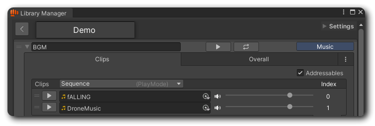
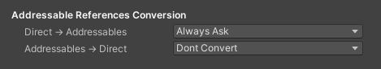

# Addressables

## Introduction

[Addressables](https://docs.unity3d.com/Manual/com.unity.addressables.html) is a dynamic asset management solution provided by Unity. It helps determine which audio clips should be loaded, when thet are needed, and how they are loaded.


This documentation covers use Addessables **in BroAudio**. For further details and the official Addressables manual, please refer to the [Unity Manual](https://docs.unity3d.com/Packages/com.unity.addressables@2.3/manual/index.html).


## How To Use?

To install Addressables package, please follow the instructions in [Unity's manual](https://docs.unity3d.com/Packages/com.unity.addressables@2.3/manual/installation-guide.html). Once the package is installed, BroAudio will automatically unlock all addressables related options. No futher configurations needed!

<figure><figcaption></figcaption></figure>

### Marking Entities and Audio Clips as Addressables

Addressables requires two things to work:

1. An asset marked as Addressables.
2. An [AssetReference](https://docs.unity3d.com/Packages/com.unity.addressables@1.20/manual/AssetReferences.html) for addressing the asset.

The first step is pretty straightforward. Just find all the audio clips you plan to use with Addressables and mark them as Addressable in the inspector.

The second step is also simple. Open the LibraryManager, select an entity, and you will see an Addressables checkbox in the upper-right area of the Clips tab. Just check it!

These two steps can actually be done at the same time. You can first add audio clips to an entity and then mark the entity as Addressable. **If the entity already contains clips, a&#x20;**<mark style="color:orange;">**Reference Conversion Confirmation**</mark>**&#x20;window will appear**, asking how you want to handle them.

### Reference Conversion

One major benefit of using Addressables is that it utilizes indirect references (usually with `AssetReference`). This means the asset is not loaded immediately when referenced, unlike direct references, helping reduce memory usage at runtime.

The confirmation window provides three options:

**\[Yes]**\
Converts the current clip list to `AssetReference` and automatically marks the corresponding audio clip assets as Addressable, so you don't have to mark them manually.

**\[Yes, don't ask again]**\
Same as \[Yes], but remembers your choice so the window won’t appear again..

**\[No] or close the window**\
No changes are made, and the Addressables checkbox remains as is.

The same confirmation window will also popup when the list is already using `AssetReference`, but in the opposite way. Clicking \[**Yes]** will convert the clip list to direct references and unmark all corresponding audio clip assets as Addressable.

#### Other Conversion Settings

You can configure additional options for reference conversion under _<mark style="color:orange;">Tools/BroAudio/Preferences - Miscellaneous.</mark>_

<figure><figcaption></figcaption></figure>

**Always Ask**\
Always show the confirmation window.

**Only Convert**\
Convert the list to the target reference type without changing the Addressables state of the clip assets.

**Convert And Set Addressables**\
Convert the list and mark/unmark Addressables on the clip assets. This is the default behavior for \[Yes] and \[Yes, don't ask again]. Plus, \[don't ask again] will change the setting to this option while \[Yes] remains on Always Ask.

**Convert And Clear All References**\
Convert the list and remove all references from it.

## Loading the asset

Now that the audio clips are set as Addressables, managing their loading process is up to us.

The API functions similarly to Unity’s standard Addressables APIs. You call the loading method, get an [AsyncOperationHandle](https://docs.unity3d.com/Packages/com.unity.addressables@1.22/manual/AddressableAssetsAsyncOperationHandle.html), wait for it to complete before using the asset, and release it when it's no longer needed.

### Public Methods in [BroAudio](../reference/api-documentation/class/broaudio.md) class

<table data-full-width="false"><thead><tr><th width="159">Method</th><th width="205">Return</th><th width="133">Parameters</th><th width="251">Description</th></tr></thead><tbody><tr><td><mark style="color:orange;"><strong>LoadAllAssetsAsync</strong></mark></td><td><a href="https://docs.unity3d.com/Packages/com.unity.addressables@1.22/manual/AddressableAssetsAsyncOperationHandle.html">AsyncOperationHandle</a>&#x3C;IList&#x3C;AudioClip>></td><td><a href="../reference/api-documentation/struct/audioid.md"><mark style="color:green;">SoundID</mark></a> id</td><td>Loads all the audio clips in the entity</td></tr><tr><td><mark style="color:orange;"><strong>LoadAssetAsync</strong></mark></td><td><a href="https://docs.unity3d.com/Packages/com.unity.addressables@1.22/manual/AddressableAssetsAsyncOperationHandle.html">AsyncOperationHandle</a>&#x3C;AudioClip></td><td><a href="../reference/api-documentation/struct/audioid.md"><mark style="color:green;">SoundID</mark></a> id</td><td>Loads the first audio clips in the entity</td></tr><tr><td></td><td><a href="https://docs.unity3d.com/Packages/com.unity.addressables@1.22/manual/AddressableAssetsAsyncOperationHandle.html">AsyncOperationHandle</a>&#x3C;AudioClip></td><td><a href="../reference/api-documentation/struct/audioid.md"><mark style="color:green;">SoundID</mark></a> id, <mark style="color:green;">int</mark> index</td><td>Loads the audio clip in the entity's clip list by index</td></tr><tr><td><mark style="color:orange;"><strong>ReleaseAllAssets</strong></mark></td><td>void</td><td><a href="../reference/api-documentation/struct/audioid.md"><mark style="color:green;">SoundID</mark></a> id</td><td>Releases all the audio clips in the entity</td></tr><tr><td><mark style="color:orange;"><strong>ReleaseAsset</strong></mark></td><td>void</td><td><a href="../reference/api-documentation/struct/audioid.md"><mark style="color:green;">SoundID</mark></a> id</td><td>Releases the first audio clips in the entity</td></tr><tr><td></td><td>void</td><td><a href="../reference/api-documentation/struct/audioid.md"><mark style="color:green;">SoundID</mark></a> id, <mark style="color:green;">int</mark> index</td><td>Releases the audio clip in the entity's clip list by index</td></tr></tbody></table>
