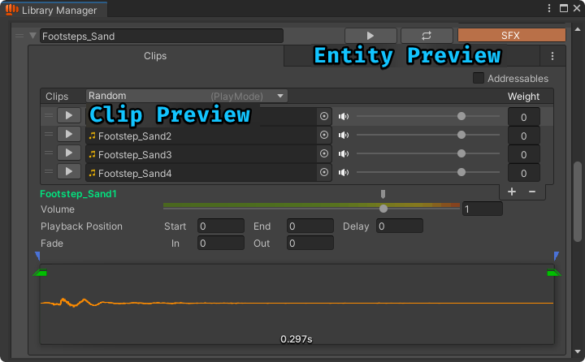
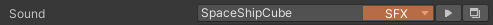

---
layout:
  width: default
  title:
    visible: true
  description:
    visible: false
  tableOfContents:
    visible: true
  outline:
    visible: true
  pagination:
    visible: true
  metadata:
    visible: true
  tags:
    visible: true
  actions:
    visible: true
---

# Editor Audio Preview

## Introduction

Playtesting is an important but time-consuming part of development. That’s why it's crucial to be able to preview your work without having to enter the game every time.

BroAudio provides several ways to preview your audio along with the settings you've configured for it, helping you speed up iteration during development.

## Ground Rules

There are two main ways to preview audio in the editor:

* **Left Click** – Plays the audio using the settings you've set up in BroAudio (e.g. volume, pitch).
* **Right Click** – Plays the raw audio clip directly, ignoring all configurations.

These two methods apply to all preview features in BroAudio, whether you're clicking a play button or interacting with the waveform view.

## Library Manager

<figure><figcaption></figcaption></figure>

#### Entity Preview

At the top of each [audio entity](library-manager/#entity), you'll find the entity preview buttons.

:arrow\_forward: When you click the play button:

1. It selects one of the audio clips based on the current [**Play Mode**](library-manager/design-the-sound/#playmode) setting.
2. It plays the clip using the volume and pitch settings you've configured (`clip volume × master volume`).

:repeat: If the replay button is toggled **on**, it will continuously replay the audio.

This replay isn’t just a simple loop, <mark style="color:green;">**it works like triggering the sound repeatedly in the game**</mark>. So if your volume or pitch is set to [**Random**](library-manager/design-the-sound/randomization.md), you’ll hear different results each time. The clip might also change depending on how your [**Play Mode**](library-manager/design-the-sound/#playmode) is set up.

#### Clip Preview

Each clip has its own play button for previewing. Clicking it will preview that specific clip and ignore the [Play Mode](library-manager/design-the-sound/#playmode) setting.

#### Waveform View

You can click directly on the waveform view to play the audio from the exact position you clicked. It will continue playing until the end of the clip.\
⚠ Start Position, End Position, Fade In, and Fade Out settings will be ignored during this preview.

## SoundID Field

<figure><figcaption></figcaption></figure>

For every [SoundID](../reference/api-documentation/struct/audioid.md) field in the inspector, a play button appears next to the dropdown.

Clicking it previews the [audio entity](library-manager/#entity) that the SoundID refers to. It behaves the same as pressing the entity preview play button in the Library Manager,  just without the replay.

