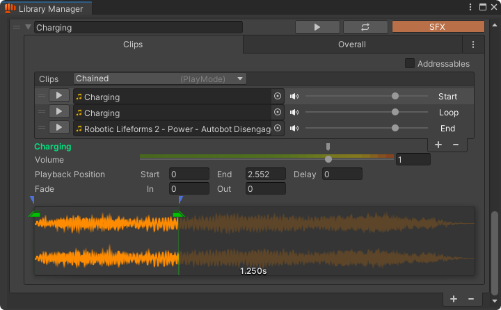

---
layout:
  width: default
  title:
    visible: true
  description:
    visible: false
  tableOfContents:
    visible: true
  outline:
    visible: true
  pagination:
    visible: true
  metadata:
    visible: true
  tags:
    visible: true
  actions:
    visible: true
---

# ⛓️ Chained Playback

## Introduction

Chained Playback lets you build a sound sequence that plays in stages: a **Start** sound, a looping **Loop** sound, and a final **End** sound. This is ideal for gameplay situations where an action has a beginning, an ongoing state, and an ending, such as casting a spell, charging a weapon, or running an engine.

## How To Use?

If an AudioEntity contains more than one clip, the [PlayMode](./#playmode) option will appear at the top of the clip list. Set it to **Chained**, and you'll see the Playback stage: Start, Loop, and End displayed on the right side.

<figure><figcaption></figcaption></figure>

### **Start**

The first sound to play when this entity is triggered to play.

### **Loop**

Plays immediately after the **Start** sound and loops continuously until it's triggered to stop.

When using Chained mode, BroAudio will automatically handle the loop playback at runtime, even if no loop options are set in the **Overall** tab. In that case, the system will use the default loop settings defined in _<mark style="color:orange;">**Tools > BroAudio > Preferences**</mark>_.

If no loop options are set in the **Overall** tab, a warning message will appear above the clip list, letting you know that default settings will be used.\
You can:

* Click **\[Apply Default]** to explicitly apply those settings to the entity.
* Hide this message in _<mark style="color:orange;">**Tools > BroAudio > Preferences**</mark>_**&#x20;- Chained Play Mode:  Show Warning If No Loop**.

### **End**

The final sound played when it's triggered to stop.

This is actually optional. If not assigned, the **Start** and **Loop** sounds will still work as expected, and playback will simply stop when `Stop()` is called.


The 3 clips don’t necessarily have to be different! You can use the same clip for all three stages by using different parts of it.

