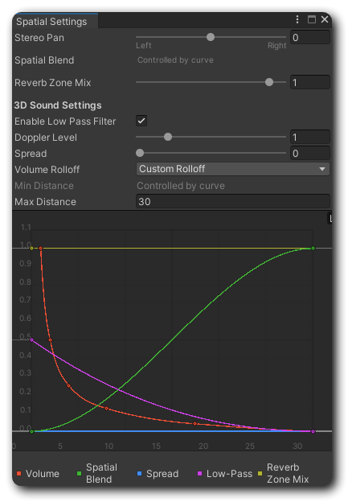

# 🎛️ Spatial & Mix

## Introduction

If you've used Unity's [AudioSource](https://docs.unity3d.com/Manual/class-AudioSource.html), you might have noticed a section called **3D Sound Settings** at the bottom. This is used to simulate how sound behaves in a real-world space. In other words, it adjusts volume and panning based on the position and distance between the listener and the sound source in the scene. So don’t let the term _3D_ mislead you🤣 this feature is just as useful in a 2D game! A more common name for it is actually **Spatial Audio**.

<figure><figcaption></figcaption></figure>

## Basic Understanding

Bro Audio’s Spatial & Mix feature combines **3D Sound Settings, Spatial Blend, Stereo Pan, and Reverb Zone Mix** into a single asset. These functionalities work exactly the same as in Unity’s AudioSource, so there’s nothing new to learn. However, if you haven’t used these features in Unity before, there’s one key value you should understand first.

#### **Spatial Blend**

This value determines how much the sound is affected by 3D Sound Settings, meaning how its volume and panning change based on the listener’s distance and position relative to the sound source.

* **0 (2D):** The sound ignores distance and position, playing directly through your audio system (speakers, headphones, etc.).
* **1 (3D):** The sound fully respects distance and position, making it behave naturally in the space.

So, if you want a sound to play at a specific location, simply set Spatial Blend to 1 (or any value greater than 0, depending on your needs).

For more details on other settings, please refer to [Unity’s documentation](https://docs.unity3d.com/Manual/AudioSource-reference.html).

## How To Use?

### **Play the sound in the scene with default settings**

If you just want the sound to play in the scene without tweaking anything, you can:

* Use the [**SoundSource**](../../no-code-components/sound-source.md) component and set [**Position Mode**](../../no-code-components/sound-source.md#position-mode) to **StayHere** or **FollowTarget**.
* Use [`BroAudio.Play(SoundID, Vector3)`](../../../reference/api-documentation/class/broaudio.md#playback) or [`BroAudio.Play(SoundID, Transform)`](../../../reference/api-documentation/class/broaudio.md#playback).

With these approaches, Bro Audio will **automatically set Spatial Blend to 1 (3D)** when playing the sound and leave all other settings at their defaults.


Curious about what the default settings are? Just add Unity’s **AudioSource** component to a GameObject, inspect its values, or play a sound to check them!


### **Play the sound with customized spatial & mix settings**

If you need more control over how the sound behaves in space, follow these steps:

1. Open the **Library Manager,** select an entity, and switch to the **Overall** tab.
2. Click **\[Create and Open]** next to the **Spatial & Mix** field. [<mark style="color:blue;">Didn't see the option?</mark>](#user-content-fn-1)[^1]
3. After Saving the spatial settings file. The **Spatial Settings** window will open immediately.
4. Adjust the properties just like you would in Unity’s `AudioSource`.

Once the sound has custom spatial settings, they’ll be applied automatically when played in the scene using the same approaches as mentioned above:

> 1. Use the SoundSource component and set the Position Mode to StayHere or FollowTarget.
> 2. Use `BroAudio.Play(SoundID, Vector3)`, or `BroAudio.Play(SoundID, Trandform)` method.


If you want the sound to play **globally**, ignoring spatial settings, you can also:

* Use **Global** Position Mode in the **SoundSource** component.
* Use `BroAudio.Play(SoundID)`.



The spatial setting is just a Scriptable Object, it can be shared around multiple sounds!


[^1]: If you can't see this option, it might be because the GUI setting of this AudioType is set to be invisible. [Click here for more details.](../../customization.md#displayed-properties)
