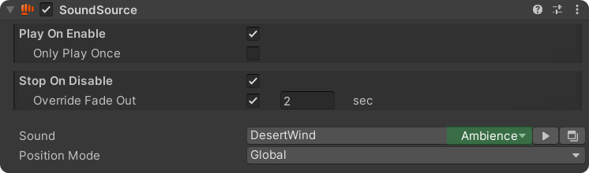

# Sound Source

<figure><figcaption></figcaption></figure>

## Play On Enable

Check this box to automatically play the sound whenever the GameObject is enabled.

**Only Play Once:** Plays the sound only the first time the GameObject is enabled.

## Stop On Disable

Check this box to automatically stop the sound whenever the GameObject is disabled.

**Override Fade Out:** Check this box to override the fade-out time setting when stopping the sound on disable.

## Sound

The sound to play. You can select the required sound via the dropdown menu.

## Position Mode

Determines the sound's location when triggered.

* **Global**: Plays globally (2D), meaning the sound can be heard everywhere.
* **Stay Here:** Plays as a 3D sound and stays where the GameObject is located.
* **Follow Target:** Plays as a 3D sound and follows the GameObject as it moves.

