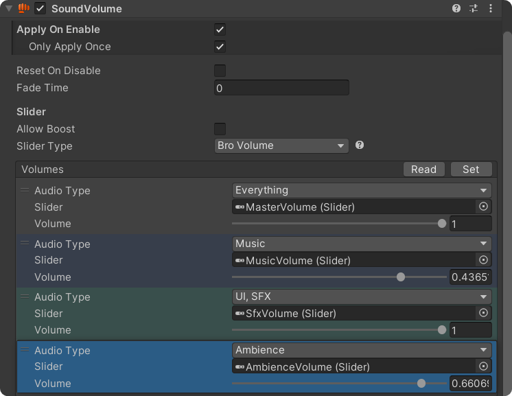

# Sound Volume

<figure><figcaption></figcaption></figure>


This component is particularly useful in the following situations

1. **Slider Binding**: Easily bind this component to a [UI slider](https://docs.unity3d.com/2022.3/Documentation/Manual/script-Slider.html) to quickly implement volume control for your game.
2. **Quick Volume Adjustment**: Temporarily adjust the volume of a specific audio type when an event occurs by enabling or disabling this component.


## Apply On Enable

Check this box to automatically apply the volume setting whenever the GameObject is enabled.

**Only Apply Once:** Applies the settings only the first time the GameObject is enabled.

## Reset On Disable

Check this box to automatically reset the volume back to the time before onEnable when the GameObject is disabled.

## Fade Time

The duration it takes to reach the target volume.

## Slider

**Allow Boost:** Check this box to allow volumes beyond 0dB.

**Slider Type:**  Determines the scale of the slider, which will also affect the [UnityEngine.UI.Slider](https://docs.unity3d.com/2022.3/Documentation/Manual/script-Slider.html) assigned in the Volumes list below.

## Volumes

**Audio Type:** The target audio type to apply the volume to. You can select multiple types or set it to 'Everything' to act as a master volume control.

**Slider(optional):** The [Unity UI Slider](https://docs.unity3d.com/2022.3/Documentation/Manual/script-Slider.html) component that syncs with the volume.

**Volume:** The volume level.

<mark style="color:purple;">**\[Read]**</mark>**&#x20;button**<mark style="color:purple;">**:**</mark> Converts the UI Slider value to volume.

<mark style="color:purple;">**\[Set]**</mark>**&#x20;button**<mark style="color:purple;">**:**</mark> Converts the volume to the UI Slider value.

<mark style="color:purple;">**\[Edit in Playmode]**</mark>**&#x20;button**<mark style="color:purple;">**:**</mark> Available in Playmode. If enabled, the volume applies directly to the system, useful for debugging.
