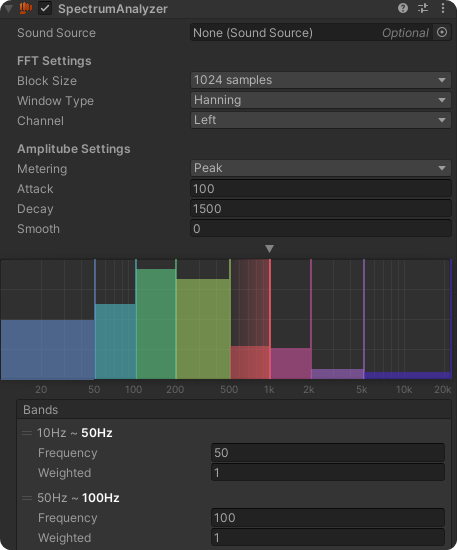
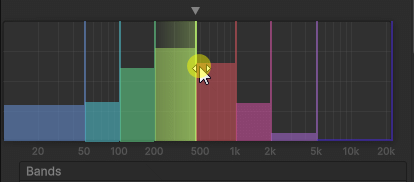

# Spectrum Analyzer

<figure><figcaption></figcaption></figure>

### Sound Source

Assign a SoundSource here to obtain spectrum data when it plays. This field is optional, meaning it can be left **null**, and the spectrum data source can be set via code at runtime.

## FFT Settings

FFT (_Fast Fourier Transform_) is an algorithm used to extract frequency information from a signal. A larger size provides better precision but comes at a higher performance cost.

**Block Size**\
Number of data samples used for FFT, which can also be considered as frequency resolution. The bigger the size is, the better precision, but also higher performance cost.

**Window Type**\
The [FFTWindow](https://docs.unity3d.com/6000.0/Documentation/ScriptReference/FFTWindow.html) type to use when sampling.

**Channel**\
The target channel from which the spectrum is sampled.

## Amplitube Settings

Instead of using raw spectrum data, BroAudio processes it into **amplitudes** for easier use and better readability.

**Metering**\
The metering type used to calculate the amplitude of each band during updates.

**Attack**\
The time it takes to **raise** a level of 20dB in milliseconds

**Decay**\
The time it takes to **reduce** a level of 20dB in milliseconds

**Smooth**\
Increase this value to smooth the spectrum changes. The higher the value, the smoother it becomes

## Bands

Defines the frequency bands used for analysis.

<figure><figcaption></figcaption></figure>

**Frequency**\
The starting frequency of the band. You can either enter a value manually or adjust it by dragging the lines in the spectrum view above.

**Weight**\
Adjusts the band's response sensitivity, allowing you to emphasize certain frequencies.

## Public Methods

<table data-full-width="false"><thead><tr><th width="173">Method</th><th width="129">Return</th><th width="193">Parameters</th><th width="249">Description</th></tr></thead><tbody><tr><td><mark style="color:orange;"><strong>SetSource</strong></mark></td><td>void</td><td><a href="../../reference/api-documentation/interface/iaudioplayer.md">IAudioPlayer</a></td><td>Set the source for fetching spectrum datas. It should be called when the <a href="spectrum-analyzer.md#sound-source">SoundSource</a> field is empty.</td></tr></tbody></table>

