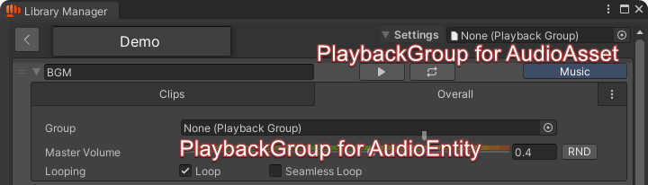

# Playback Group

## Introduction

Playback Group is a set of rules that can be used to manage the playback behavior of multiple sounds as a group. It determines whether a sound can be played and can also stop playback when certain conditions are met.

***

## How To Use?

### Creating a Playback Group

Playback Groups are ScriptableObjects that can be created by right-clicking in the Project Winodw, and selecting _<mark style="color:green;">Create > BroAudio > PlaybackGroup</mark>_.

### Assigning a Playback Group

Once created, a playback group can be assigned to [AudioAsset](library-manager/#asset), [AudioEntity](library-manager/#entity), or even passed directly when calling [`BroAudio.Play()`](../reference/api-documentation/class/broaudio.md#playback), which overrides any pre-existed groups assigned to the sound.

<figure><figcaption></figcaption></figure>

## The Hierarchical Design

Playback Groups follow a hierarchy that aligns with **AudioAssets** and **AudioEntities**, plus a system-level group (Global Playback Group) above them and an optional override when calling [`BroAudio.Play()`](../reference/api-documentation/class/broaudio.md#playback). The hierarchy is as follows:

<figure><figcaption></figcaption></figure>

This means that if no group is assigned at a specific level, the system will look for an avaliable group from its upper level until it reaches to the top level, which is the **Global Playback Group**. This top group is never null and typically have the least restrictive rules.


The **Globabl Playback Group** can be customized in _<mark style="color:orange;">Tools > BroAudio > Preferences.</mark>_


Not only does this hierarchy apply to groups, but it also applies to individual **rules** within a group. Each rule can choose to override or inherit its behavior from an upper-level group. (More details in the _Override_ section.)

***

## What it does?

A Playback Group contains **a set of rules that are evaluated whenever a sound is cued for playback**. If all rules pass, the sound plays; otherwise, playback is canceled.

When selecting the asset file of a Playback Group, the Inspector displays a table with three columns. Let’s take the built-in **GlobalPlaybackGroup.asset** as an example to explain these columns:

<div align="center" data-full-width="false"><figure><figcaption></figcaption></figure></div>

### Override

The first column, marked with a ✏️ icon, represents the Override option.&#x20;

* When **enabled**, the rule is applied within this group.
* When **disabled**, the rule is ignored, and the system searches for an applicable rule in the upper levels of the hierarchy.

Since **GlobalPlaybackGroup.asset** is at the system level (assigned in _<mark style="color:orange;">Tools > BroAudio > Preferences</mark>_), all override options are typically enabled here


If no enabled rule is found at any level, the system simply allows playback.&#x20;

This can happen if:

1. No groups have the override option enabled for a particular rule.
2. The rule does not exist in any upper-level groups (which can happen with [Custom Rules](playback-group.md#custom-rules)).


### Rule and Value

**Max Playable Count**\
This rule tracks the number of playing sounds managed by the group. If it reaches the specified limit (the value), any additional play requests will be canceled. This is useful for controlling large numbers of sounds in a scene and maintaining balance between different sound types. The default value is **Infinity**, meaning there's no limit.

**Comb Filtering Time**\
This rule prevents sounds playing in a short period of time from producing the [Comb-Filtering effect](../reference/audio-terminology.md#comb-filtering). The default value is **0.04 seconds**, but you can adjust it as needed or set it to **0** to disable this prevention.


Rules can have more properties to assist it when evaluating, these are called the "**Derivative properties**". For example, Comb-Filtering Time has:\
\
&#xNAN;_**Ignore If Same Frame**_\
Bypasses the rule if identical sounds are played within the exact same frame.

_**Ignore If Distance Is Greater Than**_

Bypasses the rule if identical sounds are played farther apart than the specified distance. If one of the sounds is played globally, it’s treated as an infinite distance <mark style="color:$info;">(may change to use the AudioListener's position in the future)</mark>. If both are played globally, it’s treated as zero distance.

_**Log Warning If Occurs**_\
Logs a warning if identical sounds are played within the prevention time.


***

## Custom Rules

The built-in GlobalPlaybackGroup and any groups created via _<mark style="color:green;">Create > BroAudio > PlaybackGroup</mark>_ are made by the **DefaultPlaybackGroup** script, which include rules like Max Playable Count and Comb-Filtering Time by default. However, you can also create a new one from scratch or inherit the **DefaultPlaybackGroup** to extend its functionality!

### Creating Custom Rules and Playback Groups

To add custom rules, create a new class that inherit from either:

* `DefaultPlaybackGroup` to retain BroAudio’s pre-configured rules
* `PlaybackGroup` to create a new group from scratch

This allows you to define new rules by declaring values and overriding methods.

***

## The API

### _<mark style="color:green;background-color:green;">Rule\<T></mark>_

A generic abstract class representing a rule in a Playback Group. It stores a value and a method that used for evaluating playbacks.

**Creation**\
Define a class that inherits from `Rule<T>`:

```csharp
// Example from DefaultPlaybackGroup
[Serializable]
public class MaxPlayableCountRule : Rule<int>
{
    public MaxPlayableCountRule(int value) : base(value)
    {
    }
    
    // Optional: Allow implicit conversion from int
    public static implicit operator MaxPlayableCountRule(int value) => new MaxPlayableCountRule(value);
}
```

**Declaration**\
Declare the Rule in the PlaybackGroup

```csharp
// Example from DefaultPlaybackGroup

[SerializedField] private MaxPlayableCountRule _maxPlayableCount = new Rule<int>(-1);
// or _maxPlayableCount = -1; if the implicit operator is implemented
```

### _<mark style="color:green;background-color:green;">PlaybackGroup</mark>_

An abstract class that defines the rules. It inherits from ScriptableObject and implements [IPlayableValidator](playback-group.md#iplayablevalidator).

#### Defining Rules in a Playback Group

`InitializeRules()`

A method that should be overridden to initialize all the rules. Please use the **Initialize(IRule, IsPlayableDelegate)** method in conjunction to setup the rules.

```csharp
// Example from DefaultPlaybackGroup
protected override IEnumerable<IRule> InitializeRules()
{
    yield return Initialize(_maxPlayableCount, IsPlayableLimitNotReached);
    yield return Initialize(_combFilteringTime, CheckCombFiltering);
}
```

`Initialize(IRule, IsPlayableDelegate)`

Assigns a method to a rule for evaluating playback.

### _<mark style="color:orange;background-color:green;">IPlayableValidator</mark>_

`IsPlayable(SoundID, Vector3 position)`

Whether the sound can be played or not. When played globally, the position defaults to [Vector3.negativeInfinity](https://docs.unity3d.com/6000.2/Documentation/ScriptReference/Vector3-negativeInfinity.html).


This method is also encapsulated as `IsPlayableDelegate`, which is used in `Rule<T>`.


`OnGetPlayer(IAudioPlayer player)`

Triggered when the player passes the rule and is about to play. You can cache the player for further control.

### Attributes

There are attributes available for Rule\<T> and PlaybackGroup.

<table><thead><tr><th width="199">Attribute</th><th width="545">Description</th></tr></thead><tbody><tr><td><a href="https://docs.unity3d.com/6000.0/Documentation/ScriptReference/SerializeField.html">[SerializeField]</a></td><td>Saves the value in the asset and exposes it in the Inspector.</td></tr><tr><td><a href="https://docs.unity3d.com/6000.0/Documentation/ScriptReference/TooltipAttribute.html">[Tooltip]</a></td><td>Displays a tooltip when hovering over a rule.</td></tr><tr><td>[InspectorName]</td><td>Changes the display name of a rule in the inspector.</td></tr><tr><td>[ValueButton]</td><td>Adds a button for modifying the rule’s value.</td></tr><tr><td>[DerivativeProperty]</td><td>ForDraws a connection line in the Inspector to show rule relationships. Use <code>isEnd</code> to specify the endpoint.</td></tr><tr><td><p>[CustomDrawing</p><p>Method]</p></td><td>Uses a custom method for drawing the rule in the Inspector.<br>parameters: Type className, string methodName</td></tr><tr><td><a href="https://docs.unity3d.com/6000.0/Documentation/ScriptReference/HeaderAttribute.html">[Header]</a></td><td>Adds a header above some fields in the Inspector.</td></tr><tr><td><a href="https://docs.unity3d.com/6000.0/Documentation/ScriptReference/SpaceAttribute.html">[Space]</a></td><td>Adds spacing in the Inspector.</td></tr></tbody></table>


