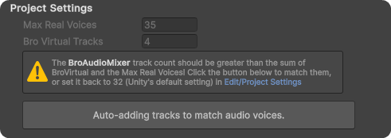

# Audio Mixer

## Introduction

BroAudio uses a custom [Audio Mixer](https://docs.unity3d.com/Manual/AudioMixer.html) with 32 tracks (matching Unity's default [Max Real Voices](../reference/audio-terminology.md#real-voices-and-virtual-voices)), plus 4 [virtual tracks](audio-mixer.md#virtual-tracks), 4 [dominator](../core-features/audio-player/dominator-player.md) tracks, 1 effect track. This design offers great flexibility in controlling sounds and can prevent many common issues (e.g. [clipping](../reference/audio-terminology.md#clipping)).


The BroAudioMixer is a fully pre-built asset that requires **no additional configuration**. This chapter is specifically intended for individuals who:

* Need to customize the mixer.
* Are eager to understand all the details.


## The Mixer Design

To guarantee that all [voices ](../reference/audio-terminology.md#real-voices-and-virtual-voices)can utilize features and be managed by BroAudio. the mixer includes 32 pre-built generic tracks. This number corresponds to Unity's default setting for [Max Real Voices](https://docs.unity3d.com/Manual/class-AudioManager.html), and it should be readjusted if this setting is altered ([Bro can rematch them automatically](audio-mixer.md#matching-the-max-real-voices)).

### Virtual Tracks

Just as the 32 tracks are designated for 'Real' voices, 'Virtual' voices also require tracks to utilize features and be managed effectively. Although they are inaudible initially, they can become audible when a 'Real' voice ceases. To ensure continuity in their current processing or settings, maintaining a number of virtual tracks as a backup is essential.


To keep the number of live mixer tracks low, a generic player releases its mixer track back to the pool while it is inaudible and reacquires one on demand. Its real computed level is preserved on the `AudioSource` while the track is released, so a virtual player never leaks to the listener at full volume, and full mixer control is restored the moment it becomes audible again.


## Customizing The BroAudioMixer

To customize the BroAudioMixer, you need to pay attention to the following few things:

### Matching the 'Max Real Voices'

If you've changed the Max Real Voices in [Project Settings](https://docs.unity3d.com/Manual/class-AudioManager.html) to a value that is greater than 32, or you've deleted some tracks. Locate _<mark style="color:orange;">**Tools > BroAudio > Preferences**</mark>_, and you should see a warning that indicates the unmatching voice count issue, and a button appears below, which could help you to match them (increase the track count) automatically, Just hit it!

<figure><figcaption></figcaption></figure>

### There are bugs in Unity Audio Mixer (But don't worry about them!)

Yes, there are bugs in Unity which bro has already handled for you! You only need to be aware of the following things when you need further customization of BroAudioMixer; otherwise, it's not necessary.

1. [Error finding Parameter path message in Exposed Parameters](audio-mixer.md#error-finding-parameter-path-message-in-exposed-parameters)
2. [Send level beyond 0dB makes Audio Mixer slider disappear at runtime](audio-mixer.md#send-level-beyond-0db-makes-audio-mixer-slider-disappear-at-runtime)

### <mark style="color:red;">Error finding Parameter path</mark> message in Exposed Parameters

<figure><figcaption>
Don't worry about these error messages
</figcaption></figure>

This message will be displayed on the Exposed Parameters of all "[Send](https://docs.unity3d.com/Manual/AudioMixerInspectors.html)" units, and this is the result produced by BroAudio after fixing this [Unity bug](https://issuetracker.unity3d.com/issues/audio-mixer-unable-to-expose-other-send-level-parameters-when-one-is-already-exposed).

The bug causes the "Send" units to be unable to expose more than one Exposed Parameter, as they can only share the same instance and parameter. However, BroAudio requires these "Send" units to have their independent parameter.

BroAudio has corrected this by assigning unique parameter paths to each unit. However, due to the persistence of the bug, the system may "incorrectly" flag these paths as erroneous. Fortunately, despite the error message, the functionality remains intact during runtime.

Although this issue has been resolved in newer versions of Unity, it can still be reproduced if we build the Audio Mixer in a fixed version of Unity and then import it into an older version. Since the BroAudioMixer is a pre-built asset that must ensure compatibility across versions, this workaround is still in use.

### Send level beyond 0dB makes Audio Mixer slider disappear at runtime

This may not be a bug, but it has the potential to cause confusion. The problem is the "[Send](https://docs.unity3d.com/Manual/AudioMixerInspectors.html)" unit in Audio Mixer can only accept send level from -80 to 0dB, but it's actually capable of handling values up to +20dB, like the "Attenuation" unit's volume.

If you see the send level's editor slider is gone, then again, **rest assured that their functions are still working properly!**

### Audio Reverb Zone issue in Unity 2021

<mark style="background-color:green;">**Update:**</mark> <mark style="background-color:green;"></mark><mark style="background-color:green;">This issue has been solved in ver. 1.01. The bug still exists, but Bro has redesigned the mixer to prevent it from happening.</mark>\
\
There is a bug that I encountered while developing BroAudio, which has been officially confirmed by Unity ([Issue Tracker](https://issuetracker.unity3d.com/issues/audio-reverb-zone-component-is-not-applied-when-effects-are-reordered-in-the-mixer)) after a bug report.

**This could only be a concern for individuals who:**

* Is using Unity 2021.
* Need to use [AudioReverbZone](https://docs.unity3d.com/Manual/class-AudioReverbZone.html).

The issue will cause the AudioReverbZone not to work, and it only occurs in Unity 2021. The problem is related to the 'Send' and 'Receive' units in the AudioMixer, and it can be reproduced in more ways than those listed on the issue tracker page.
