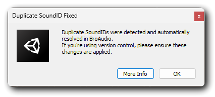

---
layout:
  width: default
  title:
    visible: true
  description:
    visible: false
  tableOfContents:
    visible: false
  outline:
    visible: true
  pagination:
    visible: true
  metadata:
    visible: true
  tags:
    visible: true
  actions:
    visible: true
---

# Duplicate SoundID Issue

### What Happened?

When an [AudioEntity](../../core-features/library-manager/#entity) (sound) is created in BroAudio, it’s assigned a unique ID. This ID is guaranteed to be unique and cannot be duplicated.\
However, you might encounter duplicate IDs under the following conditions:

* You duplicated an AudioEntity using the right-click menu or `Ctrl + D` in the Library Manager while using BroAudio versions **2.00 to 2.0.3**. Although this bug was fixed in [**2.0.4**](../release-notes.md#ver-2.0.4-unity-asset-store-github), affected entities may still share the same SoundID unless resolved manually.
* You experienced version control issues that caused two or more entities to end up with the same SoundID. Or you manually edited the SoundID via YAML or through debug mode in the Inspector.

### How to Fix This Issue

* BroAudio will detect the issue and fix it automatically when assets are saved under the folder of "<kbd>BroAudio</kbd>" since [**2.0.6**](../release-notes.md#ver-2.0.6-unity-asset-store-github).&#x20;
* If you're using a version **earlier than 2.0.6**, simply upgrading BroAudio will trigger the fix automatically when the assets are reimported.
* To run the fix manually, go to:\
  <mark style="color:orange;">**Tools > BroAudio > Others > Fix Duplicate SoundIDs**</mark>

If your project contains duplicate SoundIDs, a dialog window will appear after the fix is complete to notify you. If there are no issues, nothing will happen.

<figure><figcaption></figcaption></figure>
