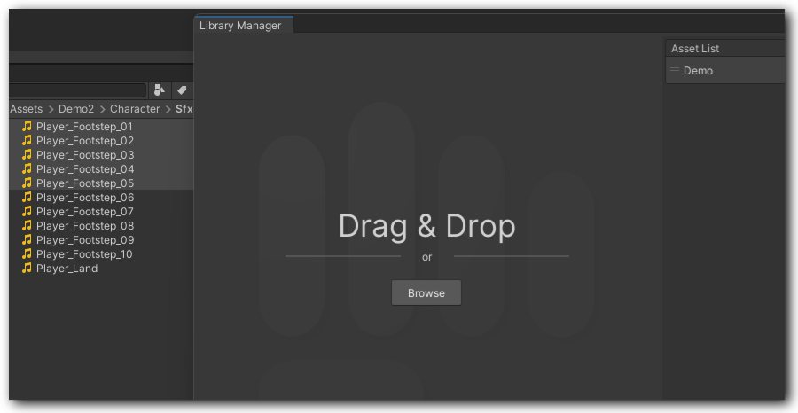
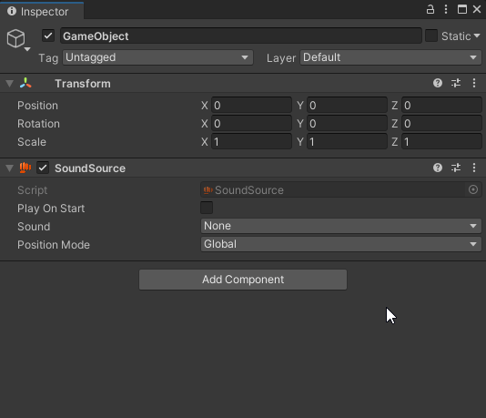
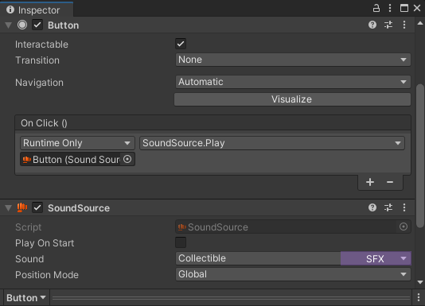
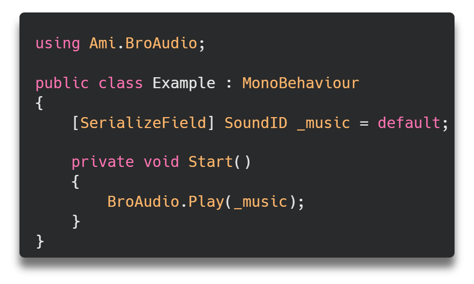

# Getting Started

## Install

Get it from [Unity Asset Store](https://assetstore.unity.com/packages/tools/audio/bro-audio-257362), install it from Package Manager

## Creating sound libraries

* **Locate** _<mark style="color:orange;">**Tools > BroAudio > Library Manager**</mark>_**&#x20;in the Unity menu bar.**
* **Drag and drop the required AudioClip.**

<figure><figcaption>
If multiple clips are dropped, a confirmation window will appear, asking how you would like to structure them.
</figcaption></figure>

* **Edit the parameters**\
  edit the clip's volume, playback position... etc.
* **Name the asset and entities and choose an** [**AudioType**](../reference/api-documentation/enums/broaudiotype.md)\
  You could also skip this step. Just remember to set it before you need them in your scene.

## Implementation

You can implement the sound you've created in Library Manager with or without coding.

### Without Code&#x20;

* **Add** **SoundSource component to a game object**
* **Select the required sound via the dropdown menu**

<figure><figcaption></figcaption></figure>

* **Choose the triggering strategy**\
  Enables "Play On Start" if you want to play it when the game object is activated at runtime. Or using [UnityEvent](https://docs.unity3d.com/2022.3/Documentation/Manual/UnityEvents.html) to trigger the Play() function like the Button's OnClick as below.&#x20;

<figure><figcaption></figcaption></figure>

### With Code

* **Declare a** [**SoundID**](../core-features/library-manager/#soundid) **and implement `BroAudio.Play()` to play it**

<figure><figcaption></figcaption></figure>

* **Select the required sound via the dropdown menu in the Inspector**\
  The same way as using [SoundSource](getting-started.md#implementation-no-code).

## Hit the play button and enjoy it!

That's all you need to start using BroAudio. Of course, there is more than just this. Check out the rest of the documentation to fully unlock all the features of BroAudio.
