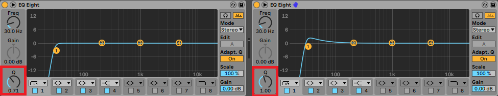

---
layout:
  width: default
  title:
    visible: true
  description:
    visible: false
  tableOfContents:
    visible: true
  outline:
    visible: true
  pagination:
    visible: true
  metadata:
    visible: true
  tags:
    visible: true
  actions:
    visible: true
---

# Technical Details

## The Audio Filter Design in BroAudio

The [Low/High Pass Filter](https://docs.unity3d.com/Manual/class-AudioLowPassFilter.html) provided by Unity is a 4-pole filter (24dB/Oct) with a Resonance Q value. At first glance, it seems pretty standard, but it actually comes with some issues. Firstly, the Resonance Q can only be set to a minimum value of 1, meaning you can't fully eliminate the resonance effect.&#x20;

<figure><figcaption>
 High Pass Filter with different Q values on Ableton Live's EQ Eight
</figcaption></figure>

The image above shows two High Pass Filter with different Q values settings. You can clearly see that when the Q is set to 1, there's a noticeable gain increase, whereas with a Q of 0.71, the response remains flat (the "flat" value may vary depending on the filter design).

This leads to another problem: clipping. Let's say we set a Highpass filter's frequency to 20Hz to mimic bypassing (since most audio doesn't have frequencies under 20Hz). Due to the inability to eliminate resonance, if the audio contains many lower frequencies, the resonance might cause clipping. This was a real issue encountered during the development of BroAudio's demo scene.

For simplicity and stability reasons, Bro opts for the [Simple Low/High pass filter](https://docs.unity3d.com/Manual/class-AudioLowPassSimpleEffect.html)—a 2-pole filter (12dB/Oct) without Resonance. Combining two filters still gives us a 4-pole filter, while also providing the flexibility to choose between the two filter types.

## Preventing Comb Filtering

If the same sound is played repeatedly in a very short period. It may cause a quality loss or unexpected behavior due to the nature of [Comb Filtering](audio-terminology.md#comb-filtering).

This short period typically falls around 30 milliseconds or less. Usually, the same sound is played within such a short time unintentionally, for example:

* Playing every frame (through Update(), FixedUpdate(), OnCollisionXXX, OnTriggerXXX …etc)\
  note: 30fps ≈ 33ms per frame, 60fps ≈ 16ms per frame.
* Using [Animation Blend Trees](https://docs.unity3d.com/Manual/class-BlendTree.html), where the animations use [Animation Event](https://docs.unity3d.com/Manual/script-AnimationWindowEvent.html) to play sounds. During the transition between two animations, both Animation Events may trigger in a very short period. For instance, during the transition between walking and running animations, both of their AnimationEvent will be triggered in the same single footstep, resulting the sound being played within a short period.


Playing multiple sounds at the exact same time won't cause comb filtering, but it will result in one sound that is many times louder, which could cause distortion, this feature can also help with that.


To address this, Bro Audio has implemented a preventive mechanism. If the same [SoundID](api-documentation/struct/audioid.md) is played again within this short period, it will be canceled.

This behavior is controlled by the [**Playback Group**](../core-features/playback-group.md), which is available in all Audio Entities/Audio Assets, as well as in the default group set under _<mark style="color:orange;">**Tools > BroAudio > Preferences**</mark>_.

<figure><figcaption></figcaption></figure>

In the Playback Group, you'll find a field called <mark style="background-color:green;">**Comb Filtering Time**</mark>. This value defines the minimum interval allowed between two identical sounds. By default, it's set to 0.04 seconds (40ms). You can adjust this value to suit your needs, or disable the feature entirely by setting it to 0.

\
For more details and advanced configuration options, please refer to the [**Rule And Value**](../core-features/playback-group.md#rule-and-value) section of the PlaybackGroup page.
